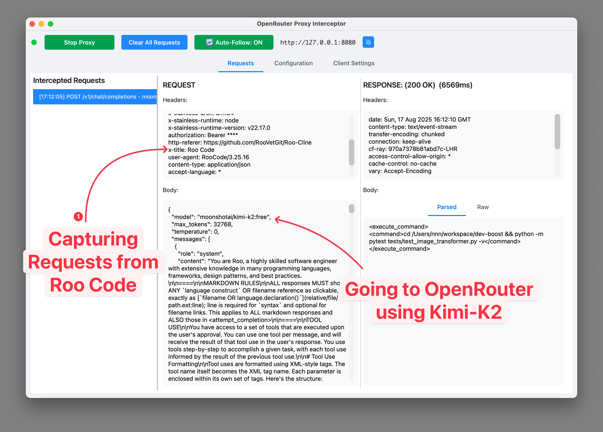

# OpenRouter Proxy Main Features

## Works as a proxy between Client <-> OpenRouter

## View live requests and streaming responses

## Use multiple API Keys

## Select multiple models to use as a fallback
